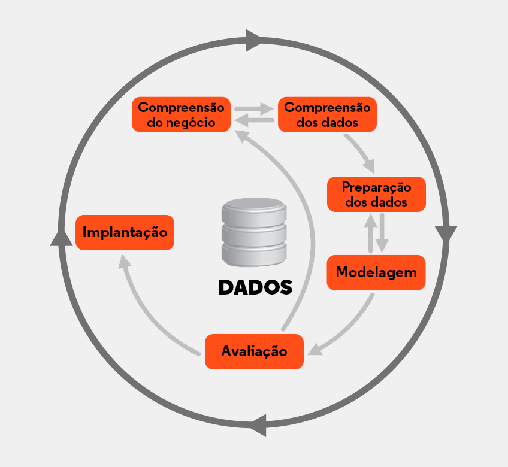
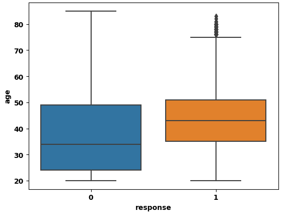
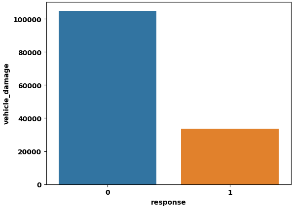
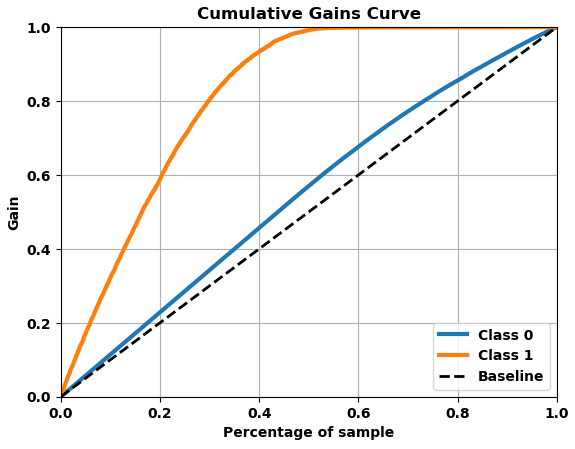
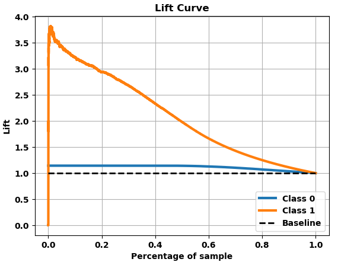

# Health Insurance Propensity Score

---

## 1. Business Problem

A empresa Effective Insurance é referência no mercado de Seguros de Saúde e agora quer ampliar seu Core Business ofertando um seguro para veículos. Este projeto consiste em preparar um modelo que aprenda a rankear, por propensão de compra, os clientes desta empresa.

Esse rankeamento se justifica com base que a Effective tem recurso limitado para contatar seus clientes.Para realizar esse contato, a empresa tem um custo alto com as ligações a serem realizadas e, portanto, apenas 25 mil (20% da base) clientes poderão ser prospectados. 

O trabalho do cientista de dados, neste caso, é elaborar o melhor ranking possível, com a propensão de compra de cada cliente e garantir que nesses 20% de pessoas, encontrará o maior número possível de interessados na aquisição do novo seguro de veículos, fazendo com  que a empresa priorize os primeiros da lista e conseguindo assim maximizar sua conversão de vendas, otimizando seu negócio e receitas.

---

## 2. Business Assumption

As variáveis/atributos originais (e seus significados) do conjunto de dados são:
| Variável 1 | Variável 2 |
|----------|----------|
| id   | Identificação para cada cliente  |
| gender   | Gênero do cliente  |
| age   | Idade do Cliente   |
| region_code   | Código da região onde o cliente mora  |
| policy_sales_channel   | Código do canal de contato escolhido pelo cliente |
| driving_license   | O cliente possui carteira de motorista?  |
| vehicle_age   | Idade do veículo do cliente   |
| vehicle_damage   | O veículo já foi danificado antes?   |
| previously_insured  | 	O cliente já possui seguro de automóvel ?  |
| annual_premium  | Valor do prêmio anual pago no seguro saúde |
| vintage   | Tempo em que o cliente já tem o seguro saúde   |
| response  | O cliente estaria interessado em seguro automóvel?   |

---

## 3. Solution Strategy 

A estratégia utilizada foi o método CRISP, dividido em 10 ações:

1. Compreender o Problema de Negócio
2. Coletar os dados
3. Limpar os Dados
4. Realizar Análise Exploratória dos Dados
5. Preparação dos Dados.
6. Selecionar as variáveis mais relevantes
7. Treinar algoritmos de Machine Learning
8. Avaliar a performance desses algoritmos
9. Implantar o modelo final em produção
10. Enviar a solução final 

## 4. Top 3 Insights 

Durante a análise exploratória de dados, foram gerados insights ao time de negócio, através da validação das hipóteses. Insights são informações novas, ou que contrapõem crenças que o time de negócios têm em mente. 

##### H1. Pessoas idosas têm mais interesse na aquisição do seguro. 

Hipótese Falsa. As pessoas mais interessadas (classe 1) em adquirir o seguro de veículo têm entre 35 e 50 anos.

##### H2. Pessoas que já tiveram o veículo danificado têm interesse no seguro.

Hipótese Falsa. A grande maioria das pessoas que já teve seu veículo danificado não tem interesse (classe 0) em adquirir o serviço de seguro 

##### H3. A maioria das pessoas interessadas tem carro há no máximo 1 ano.

| vehicle_age      | response | count id |
|------------------|----------|----------|
| below_1_year     | 1        | 5372     |
| between_1_2_year | 1        | 25233    |
| over_2_years     | 1        | 3656     |

Hipótese Falsa. A grande maioria das pessoas interessadas possui seu carro há um tempo entre 1 e 2 anos

---

# 5. Machine Learning Model Applied 

Em seguida, foram treinados 5 modelos de Aprendizado de Máquina com objetivo de encontrar o melhor algoritmo que descreva e explique o problema proposto:

- K-Neighbors Classifier
- Logistic Regression
- Extra Trees Classifier
- Random Forest Classifier
- Light Gradient Boosting Machine Classifier

Algumas métricas foram analisadas para estudar os modelos: Precision_at_k, Recall_at_k e Roc_auc

##### Precision_at_k (Precisão em k):

A precisão at k mede a proporção de itens relevantes entre os k primeiros itens recomendados por um modelo. É útil quando estamos interessados na qualidade das recomendações feitas pelo modelo nos primeiros k itens.

##### Recall_at_k (Revocação em k):

O Recall at k mede a proporção de itens relevantes que foram realmente recomendados entre os k primeiros itens recomendados por um modelo. É útil para avaliar o quão bem um modelo consegue capturar todos os itens relevantes em uma lista de recomendação. Por conta disso, é nossa métrica mais importante. Queremos saber o quanto o modelo consegue caputar nos primeiros 20% de ligações que serão realizadas para contatar os clientes.

##### Roc_auc (Área sob a curva ROC):

A área sob a curva ROC (Receiver Operating Characteristic) é uma medida da capacidade de separação de um modelo de classificação binária em diferentes limiares. Quanto maior a área sob a curva ROC, melhor o modelo é em distinguir entre as classes positiva e negativa. É uma métrica comum para avaliar a performance de modelos de classificação binária, como é o caso deste projeto.

Na tabela abaixo, o desempenho nessas métricas para os 5 modelos, considerando k = 20%, que é a capacidade máxima de ligações que a equipe consegue realizar (primeiros 20% com maior propensão de compra):

| Model Name           | Precision_at_k | Recall_at_k | Roc_auc  |
|----------------------|----------------|-------------|----------|
| KNN Classifier       | 0.333744       | 0.533953    | 0.829671 |
| Logistic Regression  | 0.303980       | 0.486334    | 0.821603 |
| Extra Tree           | 0.329165       | 0.526627    | 0.834490 |
| Random Forest        | 0.335241       | 0.536348    | 0.839927 |
| LGBM Classifier      | 0.367911       | 0.588617    | 0.862668 |

Desta forma, foi escolhido para o modelo final o Light Gradient Boosting Machine Classifier, pois apresentou melhor desempenho para nossa base de dados.

##### Recall_at_20% : 58,8%

Como visto acima, o LGBM Classifier apresentou Recall_at_20% de 58,8%. Isso significa que se contatarmos 20% de todos os atuais clientes da base para o seguro de saúde, alcançaremos 58,8% de todos os interessados em adquirir o novo seguro para veículos. Sem a utilização do modelo, de maneira aleatória, é esperado que em 20% de todos os clientes contatados, alcançaríamos apenas 20% de todos os interessados. Esses resultados podem ser melhor representados nos gráficos abaixo:

##### Cumulative Gains Curve

A Cumulative Gains Curve (Curva de Ganhos Acumulados) é uma ferramenta de avaliação de modelo que mostra a taxa de sucesso acumulada ao classificar os exemplos positivos em comparação com uma classificação aleatória.

Ou seja, podemos perceber pela curva laranja, que o "ganho" para 20% da base (primeiros 20% com maior propensão de compra) é alcançar 60% dos interessados (classe 1), comparativamente a curva traçejada (modelo randômico, sem uso de machine learning)

Obs: Para este modelo, se pudéssemos realizar contato com 50% da base, todos os interessados em contratar um seguro seriam prospectados. 

##### Lift Curve

A Lift Curve (Curva de Lift) é uma representação gráfica da proporção de resultados positivos em relação ao modelo baseline (aleatório). O eixo Y mostra quantas vezes o modelo desempenhou melhor que o modelo aleatório para um determinado número X de clientes contatados pelas ligações 

Vemos, portanto, que para 20% da base de dados (primeiros 20% com maior propensão de compra), temos uma situação em que o modelo escolhido desempenha quase 3 vezes melhor que o modelo aleatório.

---

# 6. Business Result

##### Lista Rankeada por Propensão de Compra (LGBM Classifier)

Em nossa base de dados, apenas 12,2% dos clientes da empresa responderam estar interessadas em adquirir um seguro veicular(response = 1). Assim, assumiremos este mesmo valor para os potenciais clientes que precisamos rankear:

12,2% de 127037 = 15.500 clientes interessados

Assim, nas primeiras 25.400 ligações (primeiros 20% com maior propensão de compra), 58,8% dos clientes interessados serão alcançados (recall_at_20 = 58,8%):

58,8% de 15.500 = 9.114 clientes farão a compra

##### Lista Aleatória

Na lista aleatória, nas primeiras 25.400 ligações (primeiros 20% com maior propensão de compra), 20% dos clientes interessados serão alcançados:

20% de 15.500 = 3.100 clientes farão a compra

##### Resultado Final

O Ticket médio na Effective Insurance para o seguro de veículo será de US $ 1700,00 por ano e o custo para prospectar cada cliente é de aproximadamente 10 dólares em média. 
Então, teremos um custo de 25.400 * 10 = US $254.000 

- Lucro LGBM Classifier: 9.114*1700 (receita) - 254.000 (custo) = US $ 15,24 milhões por ano

- Lucro Lista Aleatória: 3100*1700 (receita) - 254.000 (custo) = US $ 5,02 milhões por ano

Resultado: O modelo é 203 % melhor que para uma lista aleatória, representando uma diferença de lucro de US $ 10,22 milhões por ano.

Abaixo temos uma representação da tabela final simplificada , com as 5 primeiras e 5 últimas linhas rankeadas pelo modelo, com a devida coluna representando a propensão de compra para cada cliente (coluna score):

| id     | gender | age | score      | ranking |
|--------|--------|-----|------------|---------|
| 495527 | Male   | 25  | 0.99180    | 1       |
| 498170 | Female | 27  | 0.96028    | 2       |
| 413506 | Male   | 47  | 0.93890    | 3       |
| 441281 | Male   | 44  | 0.92959    | 4       |
| 470986 | Male   | 48  | 0.92176    | 5       |
| ...    | ...    | ... | ...        | ...     |
| 435035 | Female | 23  | 0.00000    | 127033  |
| 418088 | Female | 24  | 0.00000    | 127034  |
| 407334 | Male   | 21  | 0.00000    | 127035  |
| 503203 | Male   | 68  | 0.00000    | 127036  |
| 431365 | Female | 36  | 0.00000    | 127037  |

# 7. Conclusions

Os resultados de negócio mostram que o objetivo do projeto foi alcançado e, portanto, a empresa Effective Insurance terá uma grande escalada no seu faturamento ao utilizar esta solução.

Além disso, a empresa pode tomar outras ações, já que passa a conhecer um pouco mais do perfil de seus clientes que tem maior propensão a fazer uma compra, nestes contextos de negócio aqui apresentados.

# 8. Lessons Learned e Next Steps 

Em projetos seguintes, além do que já foi feito, podem ser incrementados:

- A continuação dos ciclos CRISP com possíveis novas variáveis e novas ferramentas para feature selection
- Testar outros modelos de Machine Learning
- Maximizar a performance do modelo com melhores parâmetros no Fine Tuning Hyperparameter

# 9. References

- O enunciado do projeto e os datasets estão em: [Kaggle](https://www.kaggle.com/datasets/anmolkumar/health-insurance-cross-sell-prediction)
- A imagem de capa é oriunda da: [ATMP](https://www.atmp.org.br/artigos/detalhes-do-artigo/1293/atmp+e+conamp+disponibilizam+plano+de+saude+nacional+para+associados)